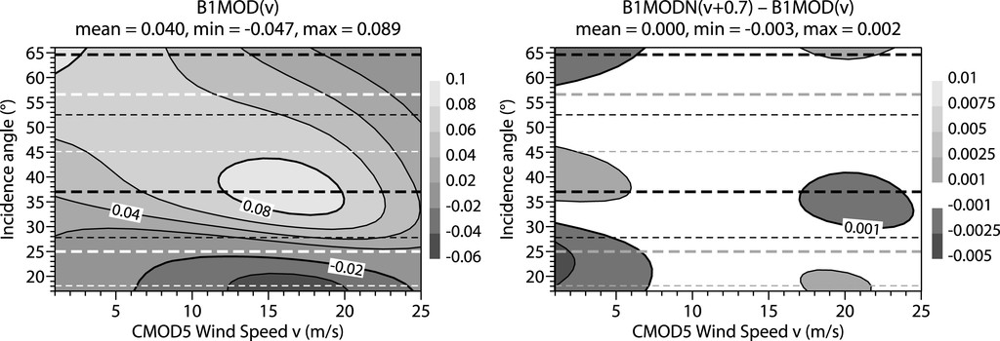
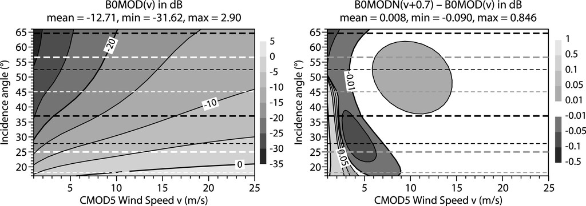
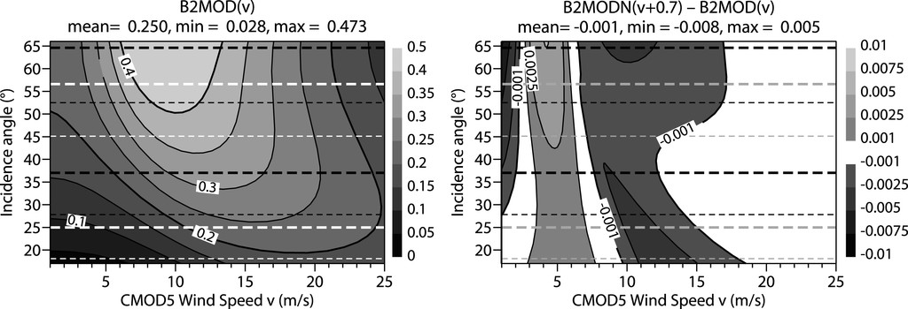

This scale dependency creates a problematic inconsistency: when observing the same ocean surface, different incidence angles produce significantly different wind field spectra after CMOD5N inversion. This suggests that the backscattering mechanisms modeled in CMOD5N do not fully account for the complex interactions between radar signals and ocean surface at different viewing geometries and spatial scales.

 

